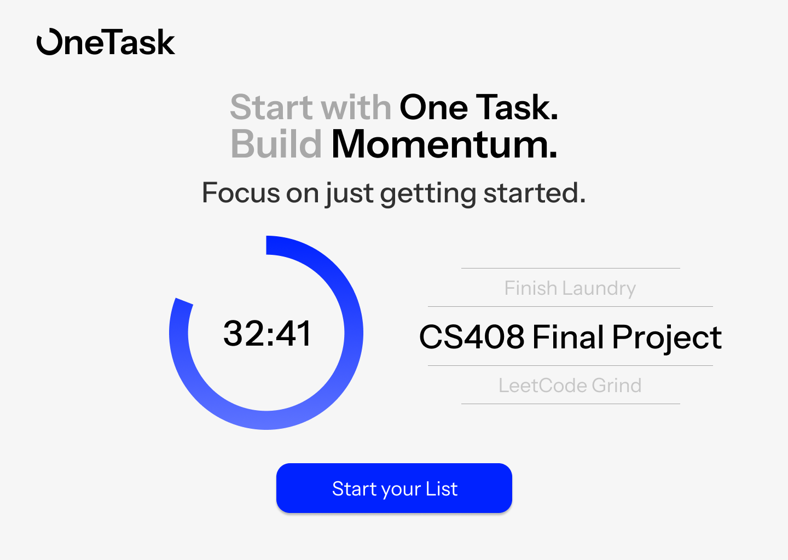
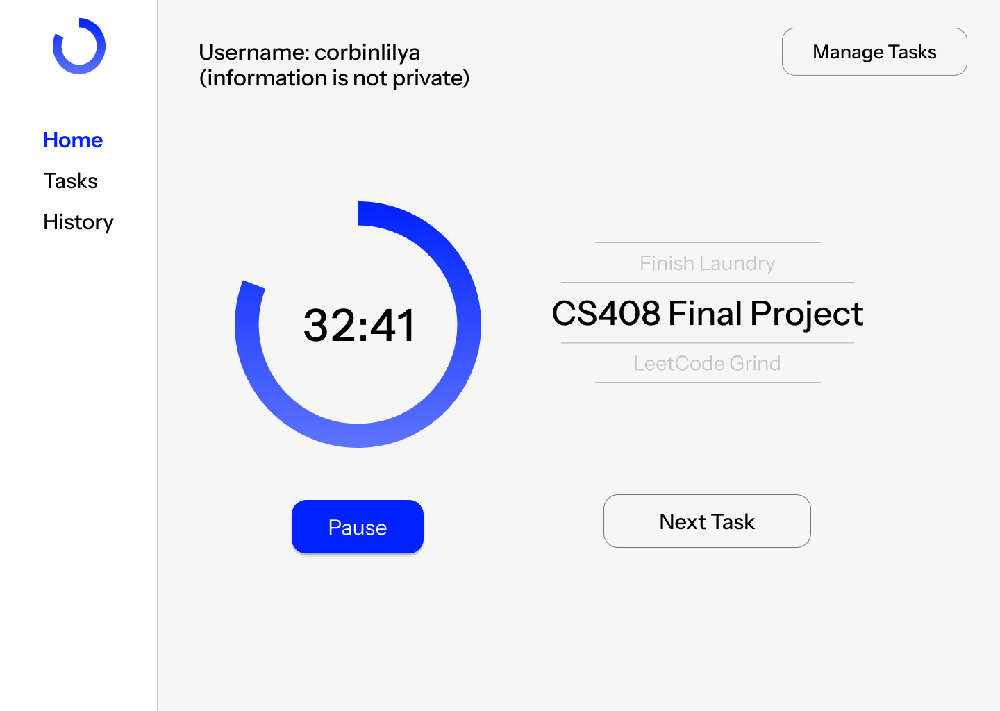
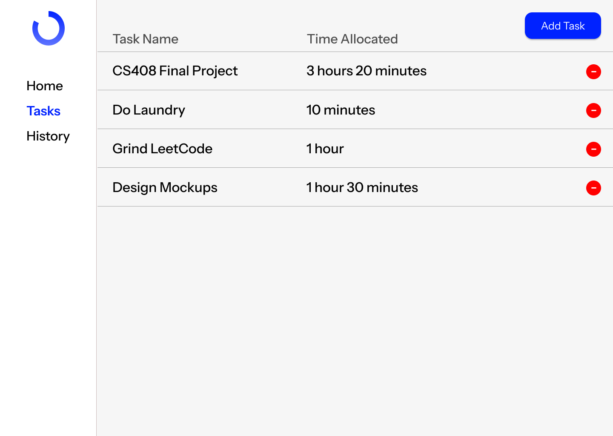

# Web Dev Final Project: OneTask

## Project Spec

### Theme
The theme of the app is a minimal productivty app web application that is meant to help users focus on getting into a flow of doing tasks and building momentum during work. It fits into the category of task management, time management, and motivation for the user to complete tasks. It is meant to be clean and easy to use. 

### What it is going to do
The purpose of the tasks is to build a list of tasks that need to be completed, in any field or subject, with a designated time limit or time estimate for them to be completed.

#### Core Features
- Create, edit, and delete tasks with given times
- Focus on one task at a time, build momentum and get in state of working with easy to do tasks first
- Display active task on home dashboard, skip and find new tasks when you don't want to do given task

Sometimes it's easier to just start doing work on anything than worry or procrastinate bigger projects or homework. I've found when I've started working on anything, it becomes easier to work on the next thing, and bigger things that I otherwise would put on. It's a snowball of work.

We will likely have notifications or sounds for alerting the user when their task is completed. I know there is browser side notifications, and I don't know how to access those yet, but it'll be something like that. Likely a simple sound.

It will have a minimal and easy to use user interface, with minimal buttons and easy to use navigation between pages. It will have at a minimum 4 pages, a landing page, a home dashboard page where the timer and current task are displayed, a tasks page for managing tasks, and a history page for seeing old tasks.

### Target Audience
There is a broad audience for this project, it could probably help anyone, but it would primarily be for:
- Students who struggle with procrastination
- Anyone who wants to focus on one thing at a time

### What Data It Will Manage
There is a lot of different information that will be managed in this project, and while the data that's stored may change as I work on the project, it should be the following:

- Session IDs / Usernames, storing separate information between users, could be auth in stretch goals
- Uncompleted Tasks, name of task, time allocated for task, associated session ID or username
- Completed Tasks for history and stats on tasks completed

### Stretch Goals
The biggest stretch goals for this task are:
- Authentication, storing users and separating information based on users.
- Pomodoro Mode, for setting intervals of task time and taking breaks.
- Categories for Tasks and starting based on category
- Streaks, consecutive days completing tasks or consecutive tasks completed in a single day.
- Dark and Light mode toggles.
- Mobile optimizations so mobile has an app like user experience through the browser. 

These are all accomplishable goals, but it's hard to say if we'll be able to complete some of them or any of them in the given timeframe for the final project. It would be cool, but we'll see how things change as I realize the size of the necessary workload for the project.

## Project Wireframe

